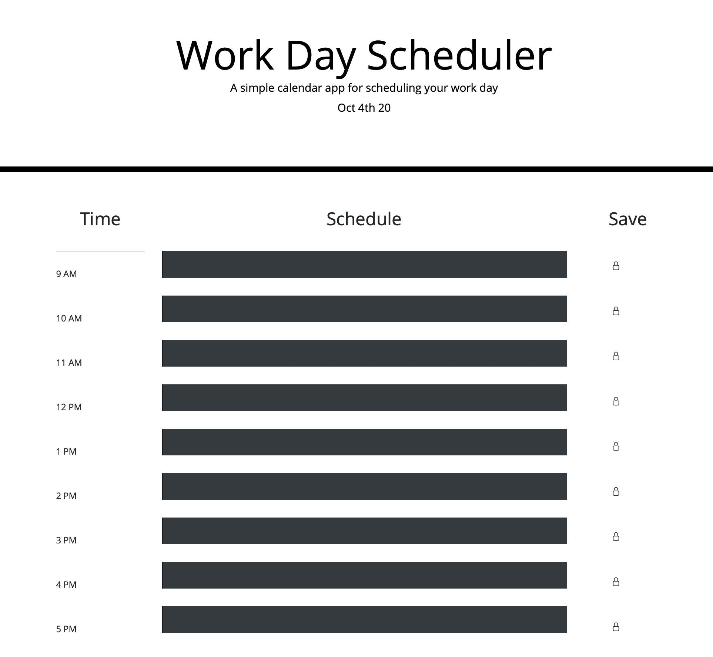

# Scheduler

# Description

This is a third-party-API site that displays the current date at the head of the page. This allows the user to input an event and save it to their local storage, and when refreshed, their events are still on saved to the page. 

This project allowed me to focus on using Bootstrap and jQuery for design and functionality, with given CSS and minimal given HTML.

# Technologies 

For this I used JavaScript, HTML, Bootstrap, jQuery, and Moment.js for functionality. I also used GitHub to store my code and for updates to my code. This project is currently being hosted on GitHub pages

Screenshot to Functional Application:

Link to Deployed Application
https://jess-smith49.github.io/third-party-API/